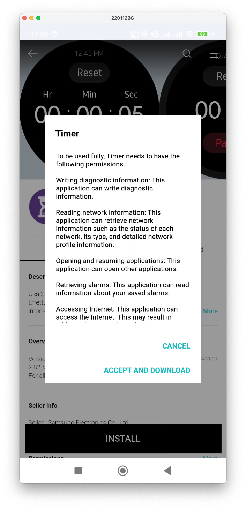

Samsung has recently alerted the public that the [Tizen service will be terminated as of September 30, 2025](https://seller.samsungapps.com/notice/getNoticeDetail.as?csNoticeID=0000009034).  
This means that after that date, we will no longer be able to download applications and watch faces for our Tizen products anymore. Moreover, in case you have to reset your watch or change the phone, you won't be able to restore you watch anymore, because even the stock apps, like reminders, stop watch, browser, weather and  many others you won't be able to download!

After Googling for a long time on forums trying to find a viable solution to the problem, I found [this great post](https://xdaforums.com/t/root-required-how-to-extract-gear-s3-watch-faces-and-apps-from-the-galaxy-store.4687851/#post-89676629) of VNNGYN on XDA, explaining a procedure to extract watchfaces and applications from the Samsung Gear S3 series.

His solution works great but, as stated by VNNGYN himself, the only way to perform the procedure is by a **rooted phone**. So after tinkering a bit, taking into account the idea of intercepting the download of the application file (WGT file) I came up with this other solutions, that doesn't need to root your phone.

### **Intercept traffic data** [TL:DR -> <a class="lightBoxVideoLink" href="imgs/vid_pcap.mp4">Video here</a>] ### 
Fortunately, the Galaxy Wearable app on Android still uses HTTP to fetch and download Tizen apps from the Galaxy Store, in a temporary directory before pushing them to the watch for the install process. So we can leverage the [PCAPdroid](https://github.com/emanuele-f/PCAPdroid) free tool to sniff traffic data and extract useful information from it. 

<p align="center">
<a href="https://f-droid.org/packages/com.emanuelef.remote_capture">
    
</a> 
<a href='https://play.google.com/store/apps/details?id=com.emanuelef.remote_capture'>
    
</a>
</p>

Open the Galaxy Wearable app, go to the Galaxy Store and select the app you want to extract, click on "INSTALL" button  **but don't click on ACCEPT AND DOWNLOAD yet!**. 
<div class="imageGallery1"><p align="center">
<a href="imgs/galaxy_store1.png"></a>
<a href="imgs/galaxy_store2.png"></a>
<a href="imgs/galaxy_store3.png"></a>
<a href="imgs/galaxy_store4.png"></a>
<a href="imgs/galaxy_store5.png"></a>
</p></div>

Switch to PCAPdroid (don't kill the Galaxy Wearable app!) and select **PCAP file** as the Traffic Dump option. Then select **Target apps** switch to filter out all the data that doesn't come from the Galaxy Wearable app. Finally click on the start button (the little "play" button in the top right part of the app). Now go back to Wearable App and click "ACCEPT AND DOWNLOAD". Once the installation is finished, you can stop the data dump, and you'll have a PCAP file stored on your device.
<div class="imageGallery2"><p align="center">
<a href="imgs/pcap_conf.png"></a>
<a href="imgs/pcap_start.png"></a>
<a href="imgs/pcap_stop.png"></a>
</p></div>

### **Extract application packet** ###
Inside of the PCAP file there's the complete dump of the data transferred from Samsung servers, including the TPK/WGT packet you installed on your watch. So now we need a way to extract and save it somewhere safe, so that we could install it anytime we like, even after the shutdown of the Galaxy Store!  
To do so, we need a tool able to parse and interpret the PCAP dump, in order to find the data packets that form our desired application. This tool exists and it's completely free: 

<p align="center">
<a href="https://www.wireshark.org/download.html">
    
</a> 
</p>

Transfer the PCAP file stored on your device to your pc (you can use any method, i.e. USB cable, Wi-Fi direct transfer, mail...), then open it with Wireshark. You will see a lot of coloured rows in the main interface.  
Scroll down until you see a green line starting with **GET /astore_bin** and select this line. Then select in the main menu **File->Export Objects->HTTP...**. 

<div class="imageGallery3"><p align="center">
<a href="imgs/wireshark1.png"></a>
</p></div>

If you did everything correct, you should see a new window like the one in the image below. Select the line containing the **App_[numbers].tpk** and click Save, give it a meaningful name, and you're done! The application is extracted and ready to be stored somewhere until your beloved watch still runs strong, not having to depend on Galaxy Store anymore! 

<div class="imageGallery3"><p align="center">
<a href="imgs/wireshark2.png"></a>
</p></div>

### **Re-sign App packet and install** ###
Unfortunately, since the downloaded packet is not signed with Samsung Platform certificates, we need to find a way to re-sign with new certificates in order to be able to install it on the watch itself. But don't worry, Samsung got us covered with Tizen Studio utilities!

First of all, enable Debugging mode on your watch inside of **About watch** menu in Settings. After that, connect your watch to the same Wi-Fi network of your PC, and write down the IP address assigned to it, we will need it later. Install [Tizen Studio](https://developer.tizen.org/ko/development/tizen-studio/download?langredirect=1) on your PC/MAC so that you have all the tools needed to sign and install the application on the watch, mainly :
- SDB command line tool
- Device Manager
- Certificate Manager

Once everything is installed, open a terminal, go to the folder <INST_FOLDER>/tizen-studio/tools> where INST_FOLDER is the root folder where you installed Tizen Studio. Next, perform this commands:

```sh
./sdb start-server
./sdb connect [watchIP]:26101 #use the IP address you wrote down before
```

Check your watch and accept the RSA key to pair with your PC.
<div class="imageGallery4"><p align="center">
<a href="imgs/sdb1.png"></a>
</p></div>

